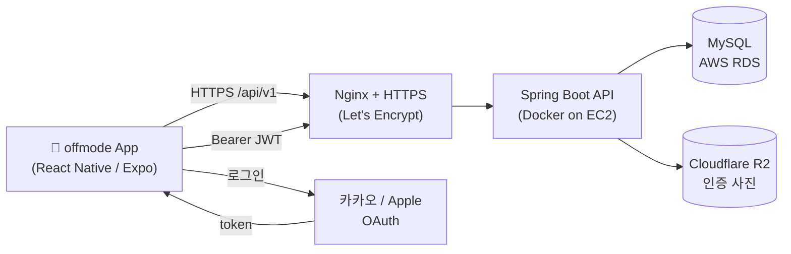
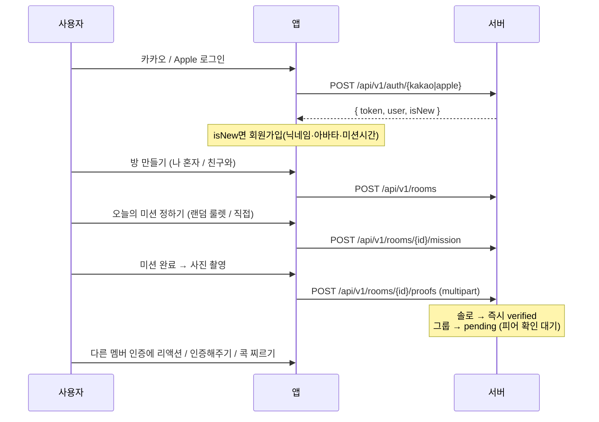
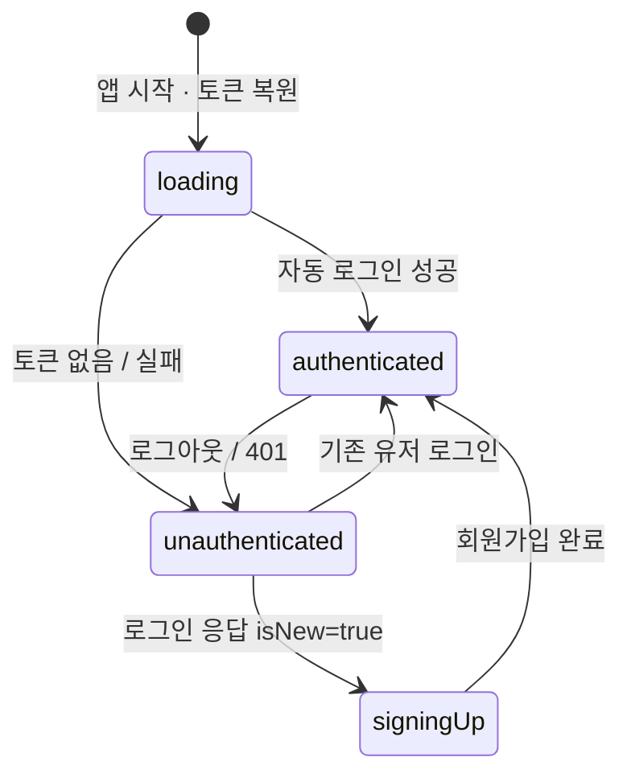

<div align="center">

# 📸 offmode

### 스크린 OFF. 일상 ON.

혼자 또는 친구와 방을 만들어 **매일 하나의 오프라인 미션을 사진으로 인증**하는 습관 형성·소셜 챌린지 앱


</div>

---

매일 하나의 미션(동네 한 바퀴 산책하기 같은 작지만 확실한 미션)을 방에서 받아, 밖에서 완료하고 사진으로 인증합니다. 그룹 방에서는 멤버끼리 서로 인증을 확인하고 🔥 리액션·콕 찌르기로 함께 꾸준함을 만듭니다.

## 📱 스크린샷

> 실제 이미지로 교체 예정 (`assets/screenshots/`)

| 방 목록 | 방 상세 | 미션 룰렛 | 인증 | 프로필 |
|:---:|:---:|:---:|:---:|:---:|
| _홈_ | _오늘의 미션·피드_ | _랜덤 뽑기_ | _사진 인증_ | _통계·꾸미기_ |
| `[ 이미지 ]` | `[ 이미지 ]` | `[ 이미지 ]` | `[ 이미지 ]` | `[ 이미지 ]` |

---

## ✨ 주요 기능

- 🏠 **방(Room) 기반 미션** — `나 혼자`(개인) 또는 `친구와`(그룹, 초대코드 공유) 방을 만들어 미션 수행
- 🎲 **오늘의 미션 정하기** — 랜덤 미션 룰렛으로 뽑거나 직접 선택
- 📷 **사진 인증** — 인앱 카메라로 미션 완료 인증. 솔로는 즉시 완료, 그룹은 멤버 `인증해주기`(피어 확인)
- 🔥 **소셜 상호작용** — 리액션, 아직 인증 안 한 멤버에게 `콕 찌르기`
- 🔥 **기록 & 꾸미기** — 연속 인증 스트릭, 프로필 통계, 인증 누적으로 캐릭터 파츠 해금
- 🛡️ **모더레이션** — 인증 콘텐츠 신고 / 사용자 차단 (App Store Guideline 1.2 대응)
- 🔔 **알림** — 사용자가 정한 시간의 미션 알림 + 리마인더
- 🌗 **다크/라이트 테마** — 웜톤 색상 시스템, 전용 폰트(Kkukkukk)

---

## 🧱 기술 스택

| 영역 | 스택 |
|---|---|
| **프론트엔드** | React Native 0.76 · Expo 52 (JSX, expo-dev-client) |
| **백엔드** | Spring Boot 3.5.14 · Java 21 (DDD 스타일) |
| **DB** | dev → H2 파일 DB · prod → MySQL (AWS RDS) · Flyway 마이그레이션 |
| **이미지 저장** | Cloudflare R2 (미설정 시 로컬 `./uploads` fallback) |
| **인증** | 카카오 로그인 · Apple 로그인(SIWA) + JWT |
| **인프라** | AWS EC2(Docker) + Nginx + Let's Encrypt · Cloudflare R2 |
| **앱 배포** | EAS Build |
| **운영 주소** | `https://api.offmodechallenge.com` |

---

## 🏗️ 아키텍처



배포 파이프라인: `v*.*.*` 태그를 **main에 push** → GitHub Actions(`deploy-backend.yml`)가 EC2에서 Docker 재빌드 + 헬스체크 + 실패 시 자동 롤백.

---

## 🔄 핵심 플로우



---

## 🔐 인증 상태머신

`App.jsx`의 `authStatus`로 최상위 화면을 분기합니다 (`utils/useAuth.js`).



| 상태 | 화면 |
|---|---|
| `loading` | 스플래시 (토큰 복원 중) |
| `unauthenticated` | `LoginScreen` |
| `signingUp` | `SignupScreen` (닉네임·아바타 → 미션 시간) |
| `authenticated` | 메인 탭 UI (방 목록) |

---

## 🗂️ 저장소 구조

```
.
├─ App.jsx              # 진입점 · 인증 상태머신 · 탭/스택 네비게이션
├─ screens/             # 화면 단위 컴포넌트 (Screen당 1파일)
├─ components/          # 재사용 컴포넌트 (ThemedText<T>, AvatarImage, WheelPicker …)
├─ utils/               # api.js, useAuth.js, notifications.js, haptics.js, avatars.js …
├─ constants/           # colors.js, warm.js, parts.js
├─ assets/ · fonts/     # 이미지 · Kkukkukk 폰트
├─ backend/             # Spring Boot 백엔드
│   └─ src/main/java/com/offmode/
│       ├─ global/          # 공통 인프라 (config, jwt, exception, file, status)
│       └─ boundedcontext/  # 도메인 (auth, user, mission, room, feed, badge)
│           └─ <domain>/    #   api/v1 · service · entity · repository · dto
└─ docs/                # 개발 · 배포 · 심사 문서
```

### 화면 목록

| 그룹 | 화면 |
|---|---|
| **인증/온보딩** | `LoginScreen` · `SignupScreen` · `OnboardingScreen` |
| **방** | `RoomListScreen`(홈) · `CreateRoomScreen` · `JoinRoomScreen` · `RoomDetailScreen` · `RoomSettingsScreen` · `RoomHistoryScreen` · `RoomCompleteScreen` |
| **미션/인증** | `MissionRouletteScreen` · `MissionPickerScreen` · `MissionTimeScreen` · `RoomVerifyScreen` · `ProofDetailScreen` |
| **프로필/설정** | `ProfileScreen` · `SettingsScreen` · `LeaderboardScreen` · `NotificationsScreen` · `BlockedUsersScreen` |

---

## 📡 주요 API

베이스: `/api/v1` · 인증: `Authorization: Bearer <JWT>` (auth/health 제외 전부 인증 필요)

<details>
<summary><b>Auth</b></summary>

| Method | Path | 설명 |
|---|---|---|
| POST | `/auth/kakao` | 카카오 로그인 → `{ token, user, isNew }` |
| POST | `/auth/apple` | Apple 로그인(SIWA) |
</details>

<details>
<summary><b>User</b></summary>

| Method | Path | 설명 |
|---|---|---|
| GET | `/users/me` | 내 프로필 (자동 로그인) |
| PUT | `/users/me` | 프로필/설정 수정 |
| GET | `/users/me/stats` | 통계 (스트릭·완료율) |
| DELETE | `/users/me` | 회원 탈퇴 |
| POST | `/users/{userId}/block` | 사용자 차단 |
| DELETE | `/users/{userId}/block` | 차단 해제 |
| GET | `/users/me/blocks` | 차단 목록 |
</details>

<details>
<summary><b>Room</b></summary>

| Method | Path | 설명 |
|---|---|---|
| POST · GET | `/rooms` | 방 생성 · 내 방 목록(솔로+그룹) |
| POST | `/rooms/join` | 초대코드로 참여 |
| GET · PATCH | `/rooms/{roomId}` | 방 상세 · 설정 수정 |
| DELETE | `/rooms/{roomId}/members/me` | 방 나가기(방장은 위임) |
| POST | `/rooms/{roomId}/members/{memberId}/nudge` | 콕 찌르기 |
| GET · POST | `/rooms/{roomId}/mission` `…/mission/candidates` | 오늘의 미션 정하기(랜덤/직접) |
| POST | `/rooms/{roomId}/proofs` | 사진 인증(multipart) |
| GET | `/rooms/{roomId}/proofs/{proofId}` | 인증 상세 |
| POST | `…/proofs/{proofId}/reactions` `…/confirm` `…/report` | 리액션 · 인증해주기 · 신고 |
| GET | `/rooms/{roomId}/history` | 방 기록 |
</details>

<details>
<summary><b>Mission · Badge · Part · Feed · Health</b></summary>

| Method | Path | 설명 |
|---|---|---|
| GET/POST | `/missions/today` | 개인 오늘의 미션 |
| GET | `/missions/pool` · `/missions/weighted-pool` | 미션 풀(룰렛용) |
| GET | `/missions/history` | 미션 기록 |
| GET | `/badges/me` | 내 배지 |
| GET/PUT | `/parts/me` · `/parts/layout` | 캐릭터 파츠 해금·배치 |
| POST/GET | `/feed/verify` · `/feed` · `/feed/stats` · `/feed/{id}/react` · `/feed/{id}/confirm` | 피드(레거시) |
| GET | `/health` | 헬스체크 |
</details>

---

## 🚀 시작하기

### 사전 요구사항
- Node.js 20 · npm 10
- JDK 21
- Xcode(iOS) 또는 Android Studio

### 백엔드 (dev)
```bash
cd backend
./gradlew bootRun        # H2 파일 DB + 로컬 파일 저장, http://localhost:8080
```
> `ddl-auto: validate`라 엔티티 변경 시 `db/migration/{h2,mysql}` 양쪽에 Flyway 마이그레이션을 추가해야 부팅됩니다.

### 프론트엔드
```bash
npm ci
npm run ios              # 또는 npm run android
```
> `expo-dev-client`라 `expo start`만으론 실행되지 않습니다. 백엔드가 8080에 떠 있어야 합니다.

### 개발용 API 주소 (`.env`, `EXPO_PUBLIC_*`)
- 시뮬레이터: 기본값 `http://localhost:8080` (설정 불필요)
- 실기기: `EXPO_PUBLIC_DEV_API_HOST=<Mac LAN IP 또는 Mac.local>`
- 상세: [`docs/development-api.md`](docs/development-api.md)

---

## 📐 개발 규칙 (요약)

전체 컨벤션은 [`CLAUDE.md`](CLAUDE.md)와 `.claude/rules/`에 있습니다.

- **텍스트**: `<Text>` 금지, `components/ThemedText`의 `<T>` 사용
- **색상**: 하드코딩 금지, `useColors()` / `useTheme()` 토큰 (dark/light 양쪽 정의)
- **스타일**: `makeStyles(C)` + `useMemo` 패턴
- **커밋**: `[Feat]`/`[Fix]`/`[Docs]`/`[Refactor]`/`[Test]`/`[Chore]`/`[Infra]` — `[Type] #이슈번호 요약` (git hook 강제)
- **브랜치**: `<prefix-lowercase>/<issue-number>` (예: `feat/151`)
- **푸시 전 CI**: 프론트 `npm run lint` · 백엔드 `./gradlew spotlessCheck test build`

### API 응답 규칙
- 성공: `ResponseEntity<DTO>` (데이터 없음 → 204, 빈 목록 → `[]` 200)
- 에러: `ErrorStatus` enum → `BusinessException` → `GlobalExceptionHandler`가 `{ isSuccess, code, message }`로 변환 (메시지 한국어)

---

## 📦 배포

### 백엔드 (태그 push 자동 배포)
```bash
# develop → main 반영(PR 머지) 후
git tag v0.4.0 origin/main        # ⚠️ 반드시 lightweight (git tag -a 금지 — fetch clobber)
git push origin v0.4.0            # → deploy-backend.yml 트리거
```
> **함정**: annotated 태그는 워크플로 fetch를 깨뜨림 · MySQL 마이그레이션은 로컬 도커로 사전 검증 권장 · 배포 완료 = `/api/v1/health` UP + 동작 확인. 상세는 [`docs/backend-ec2-deploy.md`](docs/backend-ec2-deploy.md)

### 앱 (EAS)
```bash
eas build -p ios --profile production
eas submit -p ios
```
> OTA(EAS Update) 미설정 — 코드 머지만으로는 사용자에게 반영되지 않고, 새 빌드 제출이 필요합니다.

---

## 🎨 디자인 시스템

### 미션 카테고리
| 카테고리 | 색상 | 의미 |
|---|---|---|
| Vitality | 🟢 green | 활동, 산책, 운동 |
| Energy | 🔵 blue | 자기관리, 뷰티, 루틴 |
| Intellect | 🟣 purple | 소비, 탐험, 발견 |

### 아바타
5종 캐릭터(토끼·병아리·수달·펭귄·다람쥐, `01`~`05`, PNG). 회원가입 시 선택하며, 인증 누적으로 파츠(왕관·선글라스·리본 등)를 해금해 캐릭터를 꾸밉니다.

---

## 📚 문서

| 문서 | 내용 |
|---|---|
| [CLAUDE.md](CLAUDE.md) | 프로젝트 컨벤션 전체 |
| [docs/development-api.md](docs/development-api.md) | 개발 API 주소 설정 |
| [docs/db-migration.md](docs/db-migration.md) | Flyway 마이그레이션 |
| [docs/ddd.md](docs/ddd.md) | 백엔드 도메인 구조 |
| [docs/rooms-v2-api-contract.md](docs/rooms-v2-api-contract.md) | 방(Room) API 계약 |
| [docs/backend-ec2-deploy.md](docs/backend-ec2-deploy.md) | 백엔드 배포 절차 |
| [docs/oauth-console-checklist.md](docs/oauth-console-checklist.md) | OAuth 콘솔 설정 |
| [docs/app-store-metadata.md](docs/app-store-metadata.md) · [docs/app-review-notes.md](docs/app-review-notes.md) | App Store 제출 자료 |
